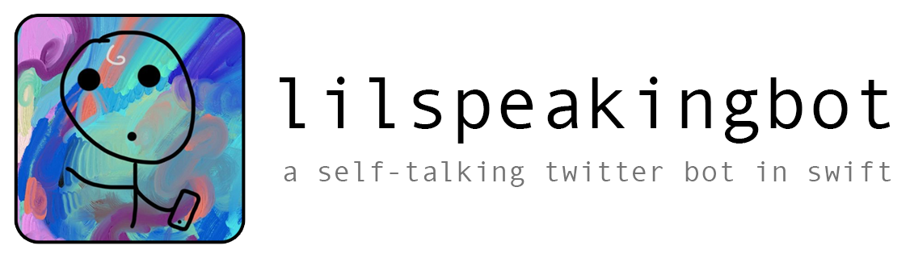

  

A twitter bot that tweets a sentence it generates determined by the fitness of the sentence

## How it works

In its current implementation, this bot works in the following way:

When it tweets, 20 (can be easily changed) different sentences are generated. This is done by selecting a random sentence structure, and then for each word type in the returned sentence structure, a random word is filled in its place.

For example, if the sentence structure was [.noun, .adverb, .pronoun], a random int is generated and the a variable is assigned the value of that position in the noun array. This is done for all word types.

Every word has an associated double value with it. This value is the words fitness level. For each sentence that is generated, the fitness values for each of the words is added together and divided by the amount of words, so as not to favour longer sentences. Whichever sentence has the highest fitness level is selected and gets tweeted.

## Ideas for future versions

Obviously one of the most important tasks is to add more words to its knowledge base. The idea of this bot is not for it to know every word in the dictionary, but to have a knowledge base of words that make sense for the context it will be used in.

Perhaps some other form of using the fitness of words to generate better sentences would be useful. At the moment the fitness of a sentence is only generated and used once the sentence has been generated. A possible way to improve word selection would be to add an algorithm whereby for each sentence structure, the program tries different words for each of the word types to find the highest fitness level within 5 iterations. The thing to be wary of here though is as the knowledge base has a small set of words within it, implementing this idea could result in the same sentence being produced every time.

# License

lilspeakingbot is licensed under the MIT License. See the LICENSE file for more information.
